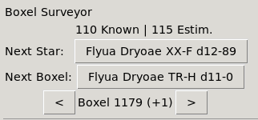

# EDMC Boxel Surveyor

An [EDMC](https://github.com/EDCD/EDMarketConnector) plugin for systematically
enumerating boxels.

## Introduction

This plugin lets you do two things:

* Quickly go to the next system in the current boxel (assuming it exists).
* Quickly go to a nearby boxel of the same mass code (assuming it exists).

## Installing

* You need [EDMC](https://github.com/EDCD/EDMarketConnector).
* Clone this repository, or extract a release, to your EDMC plugins directory.
* Launch EDMC. The plugin should now be ready to use.

## Usage

* Click on the star name next to "Next Star" or "Next Boxel" to copy it to the
  clipboard. Then paste into the search field of Galactic Map.
* By default, "Next Star" is the star with the lowest index unknown to EDSM.
  * Disable "Skip known systems" in plugin preferences to have it be the next
    star, regardless of whether it is visited.
* "Next Boxel", and the arrows beneath it, enumerate boxels in [Hilbert curve
  order](https://en.wikipedia.org/wiki/Hilbert_curve). This means that 
  traversing boxels in order will eventually visit every boxel while always 
  moving exactly 1 boxel's worth of distance per step.
  * You may discover that "Next Boxel" points to a star that doesn't exist,
    particularly with low mass codes (e.g. 'a') or in sparse regions (e.g. 
    Oevasy). Continue enumerating boxels using the arrows, or use the Galaxy 
    Map to pick a nearby star you haven't visted.
* "Known" counter shows how many stars in the current boxel are known to EDSM.
* "Estim." counter shows minimum total count of stars in the current boxel based
  on highest index known to EDSM. There may be more than this.

## FAQ

* The star name in "Next Star" is incorrect
  * "Next Star" and "Next Boxel" use _systematic_ names of Stellar Forge, which 
    can be different from a star's display name if it has a special name (e.g. 
    Sol) or is part of a sector override (e.g. Core Sys Sector).
* The star name in "Next Star" contains "Unknown Sector"
  * You are in a sector that was uploaded to EDSM very recently (so 
    `sector-list.csv` doesn't know about it). You can replace
    `utils/sector-list.csv` with a [newer one](https://edastro.b-cdn.net/mapcharts/files/sector-list.csv).
  * Or, you are outside the perimeter of Stellar Forge generation (so the 
    sector name is unknowable because the true generation rules of sector names 
    were unknown). Use the Galaxy Map to find stars to explore.
  * There _is_ [prior work](https://bitbucket.org/Esvandiary/edts/src/develop/edtslib/pgnames.py)
    on sector name generation, but the algorithm is moderately _involved_ and I
    don't feel like integrating it
* The unknown star you sent me to is already explored
  * By an explorer not uploading data to EDSM or EDDN. Not all players run tools
    in the background while playing E:D; tools like this only know about systems
    that were found by players running uploading tools.
* I find a bug
  * Create an issue in issue tracker and I will look at it eventually.

## License

This code is in the public domain (except as noted below).

This code redistributes the following third-party packages under their
respective licenses:

* [hilbertcurve](https://github.com/galtay/hilbertcurve) 2.0.5 (modified),
  MIT License (`thirdparty/hilbertcurve/LICENSE`)
* [pyperclip](https://github.com/asweigart/pyperclip)@e16fa9c, 3-clause BSD
  (`thirdparty/pyperclip/LICENSE.txt`)